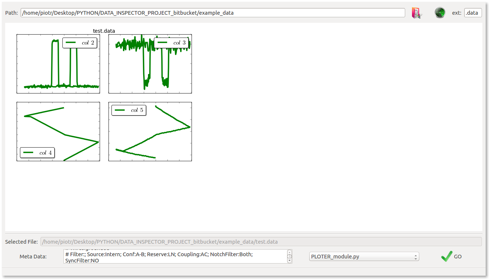
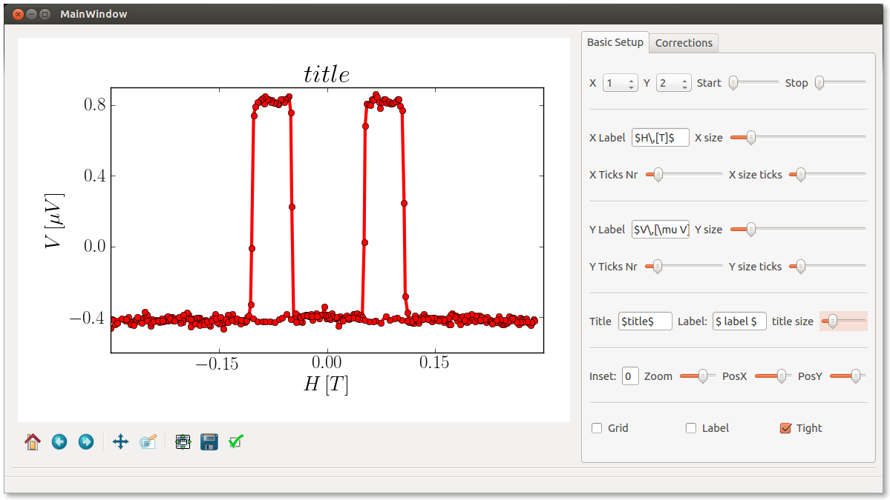

# Welcome to *Data Inspector Advanced 'DIA'* wiki page !!!

##DAI Description

This script aims for fast data-files reporting/viewing in a selected folder. It creates an html page containing thumbnails of files which extension is to be specified (column delimiter is detected automatically...). All Data-file columns will be displayed in the thumbnails... (Work in progress)

##Modules
Moreover this script allows application of external python modules - that need to be included in "modules" directory and need an extension ending with "*_module.py" that can be executed on a selected file (when selecting a thumbnail). An example module named "PLOTER_module. py" can be found in the modules directory, and can be instantly apply to a selected file (by selecting a thumbnail -> selecting module-> and pushing "GO" button)...

###Ploter Module
This module provides GUI interface for most of matplotlibs standard plotting options. It also provides a possibility to manipulate data -> corrections, derivatives etc...
It can be use as an independent script if parsing the data-file path as a sys.arg (i.e. 'python PLOTER.py "datafile.data"' on linux platform)

##Example data-file
Example data-file can be found in example_data folder...

##Dependencies
I wanted to keep it as simple as possible in point of view of extra libraries, so finally what you need to make it work is:

- numpy
- scipy
- matplotlib + pylab
- PyQt4
- sys, os, random, subprocess, glob (python standard)

##What is left to enhance in DIA
There are several things that I would like to change in this python script however lack of time for this project limits my interest in further development.
I hoped to ask for your help in further development of this script to be much better and more universal. It can be very useful for scientists and not only but it needs to be a little more flexible.

### Modification propositions:
* load data only once from a selected file and then operate on it (now each modification reloads the original data file with some restrictions put on the loaded data for example by skipping a selected number of header and footer lines (start and stop edit lines in GUI)) 

* use numpy masked arrays for loading data manipulations (filtering, limits etc.....instead of reloading from file each time)

* decide from which columns to make thumbnails (default option is for all ...) - necessary ...?

##Thanx & Contribution
This project was inspired by a great work of my colleague Danny Hykel who first showed me the wonderful world of python for science and developed first base version of the Data Inspector ...

